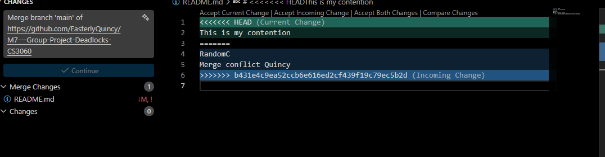

# Deadlock Demonstration

This C++ project shows the four Coffman conditions required for a deadlock and demonstrates a solution for each one:

1. Mutual Exclusion
2. Hold and Wait
3. No Preemption
4. Circular Wait

## Project Status

The main program and all four deadlock solutions are implemented. The command-line menu lets the user run each condition, view a generic deadlock, or quit. Each condition shows how changing one Coffman condition can prevent the deadlock.

## Program Features

- A command-line menu with four condition demonstrations, a generic demonstration, and a quit option.
- Separate functions for `MutualExclusion()`, `HoldAndWait()`, `NoPreemption()`, and `CircularWait()`.
- Three philosopher threads and three shared forks.
- Clear console messages that show when a fork is acquired, when a thread waits, and whether a deadlock is found.
- A controlled `GenericDeadlockDemo()` that returns to the menu.

## How the Deadlock Works

The program uses three philosophers and three forks. Each fork is a shared resource.

- Philosopher 1 holds Fork 1 and waits for Fork 2.
- Philosopher 2 holds Fork 2 and waits for Fork 3.
- Philosopher 3 holds Fork 3 and waits for Fork 1.

Each philosopher holds one fork while waiting for another. This creates a circle where no thread can move forward.

## Solution: Mutual Exclusion

Assigned group member: Tyler Francom

Mutual exclusion means only one thread can use a resource at a time. The program first uses locked forks to show the deadlock. The solution makes the forks shareable, so every philosopher can use the needed forks and finish.

## Solution: Hold and Wait

Assigned group member: Quincy Easterly

Hold and wait means a thread keeps one resource while waiting for another. The solution makes each philosopher request both forks at the same time. If both are not ready, the philosopher waits without holding either one.

## Solution: No Preemption

Assigned group member: Dylan Edwards

No preemption means a resource cannot be taken from a thread. The solution uses a watchdog that waits for a timeout and then releases one held fork. This breaks the deadlock and lets the philosophers continue.

## Solution: Circular Wait

Assigned group member: Jaden Ewell

Circular wait means each thread waits for a resource held by the next thread in a circle. The solution requires every philosopher to take the lower-numbered fork first. One shared order prevents a waiting circle from forming.

## Generic Demonstration

The generic option prints ten cycles where none of the philosophers can move. It then reports that no progress occurred and returns to the main menu.

## Build and Run

Use a C++17 compiler with thread support:

```sh
g++ -std=c++17 -pthread p7.cpp -o deadlock-demo
./deadlock-demo
```

## Contributions

- Tyler Francom: Mutual Exclusion
- Quincy Easterly: Hold and Wait
- Dylan Edwards: No Preemption
- Jaden Ewell: Circular Wait
- Brayden Carlson: Boilerplate, initial deadlock example, merging, and README documentation

---

# Project Documentation

## Issues Encountered

The group had problems with scheduling, assigning roles, and merging changes into the main GitHub branch. Roles were selected on a first-come, first-served basis in the group chat, which reduced the need for meetings. One group member was also assigned to merge changes into the repository.

A merge conflict encountered by the group is shown below:



## Real-World Connections to Deadlock Conditions and Solutions

### Mutual Exclusion

**Example:** Two drivers enter a one-way road from opposite directions. The road cannot be shared in both directions, so neither driver can move.

**Solution:** Add another road or lane. Each driver then has a separate resource and can continue.

### Hold and Wait

**Example:** One person has the bread for a sandwich while another person has the other ingredients. Each person holds something while waiting for what the other person has.

**Solution:** A person may begin only when both the bread and the other ingredients are available together.

### No Preemption

**Example:** A person wants a theater seat that someone else is using. The person cannot take the occupied seat.

**Solution:** A theater employee can decide when the seat must be released or reassigned.

### Circular Wait

**Example:** Two people in a hallway keep moving in the same direction as they try to pass. Each person blocks the other.

**Solution:** Require everyone to walk on the right side of the hallway. A shared movement rule prevents the block.

## Deadlock Encountered by the Group

The group experienced a circular wait while assigning work. Five group members could choose from five roles, but each person waited for someone else to choose first. Because nobody started, no roles were selected.

The circular wait was broken when one member chose a role first. This created a starting point and allowed the remaining roles to be chosen or assigned.
